

# Career Counselling

**Evidence**
I completed the career development activities and quizzes. I set SMART goals and explored my values, strengths, and long-term career aspirations.

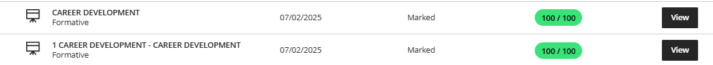
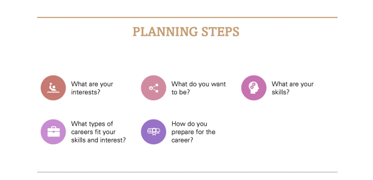

*The above are screenshots from the  learning materials for career development*

**Reflection**
**Situation:**  I was unsure of my career direction.  
**Task:** I needed to identify a clear path aligned with my goals.  
**Action:** I completed self-assessments, explored options by researching online, and created a development plan.  
**Result:** I now have a clearer idea of what I want to pursue and steps to achieve it.

# Skills and Interests

**Evidence**
I identified my top skills and interests using the skills and interests quiz. I also reflected on my vocational interests and how they align with career options.

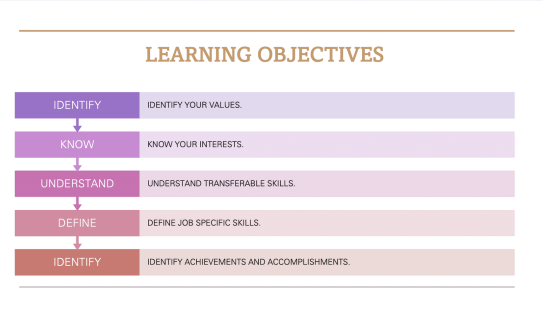
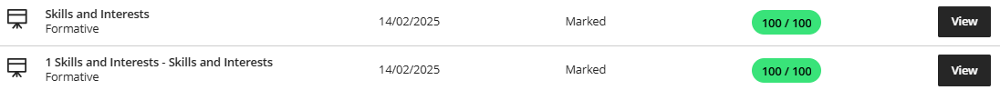

**My Skills and Interests are:**
- Drawing
- Coding
- Playing the clarinet
- Leadership
- Teaching
- Learning new languages
- Software development
-

**Reflection**
**Situation:** I didn’t know which skills were my strengths.  
**Task:** Understand what I’m good at and what I enjoy doing.  
**Action:** Completed self-assessments and reflected on past experiences.  
**Result:** I found that I enjoy creative tasks, leading and following structured processes to achieve results and want to focus on roles that involve those skills.

# Personality Assessment

**Evidence**
I completed the personality assessment and learned how my personality fits into different work environments and job roles.

**Reflection**
**Situation:** I wanted to know why certain jobs didn’t feel right.  
**Task:** Match my personality with the right job environment.  
**Action:** Took the assessment and researched matching roles.  
**Result:** I learned I do best in structured, people-focused roles and will focus my job search accordingly.
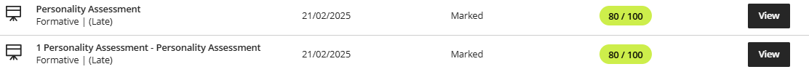

# Create a CV

**Evidence**
I created a professional CV including all required sections like contact info, education, work experience, and skills.

**Reflection**
**Situation:** My CV was not ready for job applications, as it lacked many important things.  
**Task:** Build a strong, professional CV.
**Action:** Used module tips to write and format my CV.  
**Result:** I now have a clear, tailored CV ready to submit with job applications.

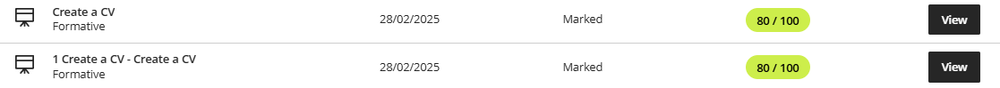
# CV Submission

**Evidence**
I finalized and submitted my CV. I edited it for clarity and professionalism and included all relevant details.

**Reflection**
**Situation:** I needed to submit a final version of my CV.  
**Task:** Ensure my CV was polished and job-ready.  
**Action:** Reviewed and applied feedback, checked formatting and spelling.  
**Result:** I submitted a complete and professional CV I can use for job applications.

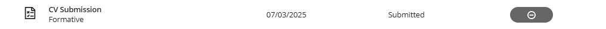

**Link to CV**: https://github.com/wil-it2025/cv-tutorial-EthanLeRoux/blob/main/Ethan%2BLe%2BRoux%2BStudent%2BCV%2B222622172.pdf

<embed src="Ethan+Le+Roux+Student+CV+222622172.pdf" type="application/pdf" width="100%" height="600px" />

# Business Communication

**Evidence**
I worked through the business communication slides and completed the quizzes
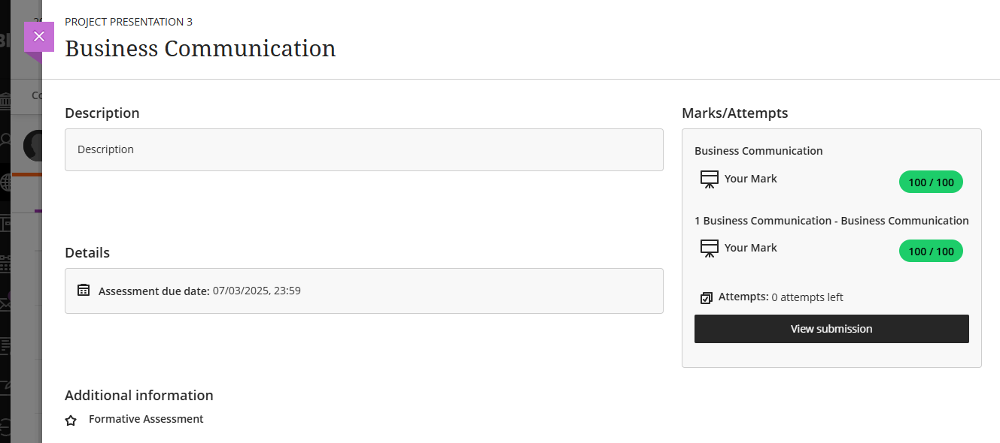

**Reflection**

**Situation:** To prepare for effective communication in professional settings, I needed to complete the Business Communication module and develop a clear understanding of how to communicate appropriately in different workplace contexts.

**Task:** Go through the content and quizzes to strengthen my ability to apply business communication principles in real-world scenarios.

**Action:** I studied the slides and completed the quizzes, which explored topics such as the purpose of business communication, examples of non-verbal communication, the appropriate use of formal language, and maintaining a professional tone in written and virtual communication. These helped me understand how effective communication can influence teamwork, productivity, and professional relationships.

**Result:** I completed the Business Communication module with a full score of 100%. Through this, I gained valuable insights into how to communicate clearly and professionally, adapt my tone to different audiences, and uphold etiquette in both in-person and virtual workplace environments. This will help me communicate more effectively in my academic, professional, and collaborative interactions.

# Interview Skills

**Evidence**
I worked through the business communication slides and completed the quizzes

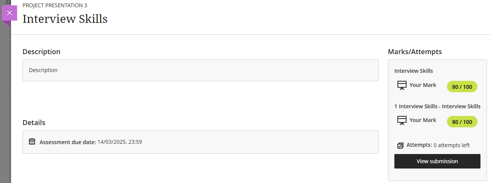

**Reflection**

**Situation:** I needed to go through the material on Interview Skills.  
**Task:** Complete the module and take what I learned from it to apply in the real world.  

**Action:** Read through all the content necessary and complete the quizzes to solidify my understanding.

**Result:** I completed the Interview Skills content, and submitted to blackboard.

# Mock Interview

**Evidence:** To prepare for work integrated learning, I created a mock interview video and uploaded it to BlackBoard.

<video controls src="Mock Interview.mp4" title="Title"></video>

**Link to Video:** https://github.com/wil-it2025/cv-tutorial-EthanLeRoux/blob/b8802abbfb212b7072d082ec0b47ad884ab86db2/Mock%20Interview.mp4

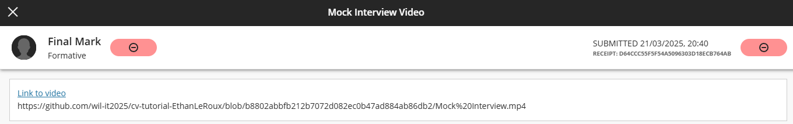

**Reflection**

**Situation:** In the world of work, interviews are a important part of determining suitability for a role, and as we'd be doing work integrated learning in real work enviroments, I needed to go learn how to partipate in interviews.

**Task:** Create a mock interview video answering various questions that would usually be asked in real interviews. 

**Action:** Choose and prepare responses to some interview questions, and create the mock interview video answering said questions.

**Result:** I completed the Interview, learning more about what it takes to be interview ready. I learnt about the interviewing process and more about myself as I had to sit down and acknowledge aspects of myself such as my strengths and weaknesses.

# Professional networking
**Evidence**
I worked through the Professional Networking slides and completed the related quizzes. These focused on understanding the purpose of networking, identifying effective strategies, and recognizing common mistakes to avoid when building professional connections.

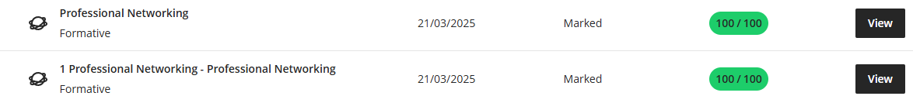
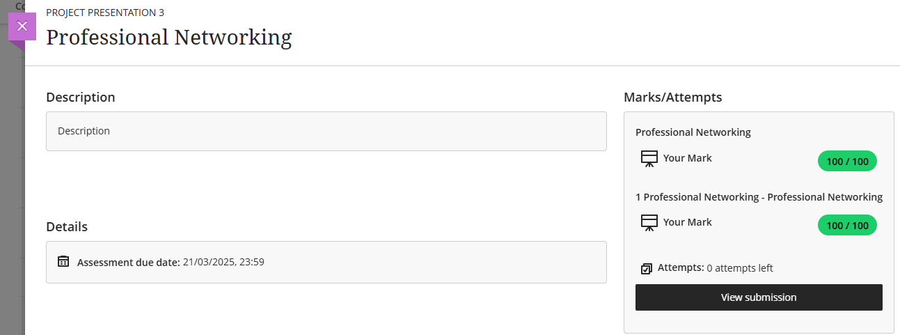

**Reflection**

**Situation:** I needed to go through the material on professional networking.

**Task:** Complete the module and take what I learned from it to be able to apply it in the real world.  

**Action:** I studied the slides and completed the quizzes, which covered key concepts such as the primary purpose of networking, the meaning of a networking event, and the “golden rule” of networking—to offer help and value to others rather than focusing only on personal gain. I also learned about common networking mistakes, such as failing to follow up or not maintaining connections, and identified the first step in creating a network, which is recognizing and reaching out to people within my existing circles.

**Result:** I successfully completed the Professional Networking module and quizzes. From this, I learned that effective networking is about consistent communication, professionalism, and reciprocity. This knowledge will help me grow my professional presence and form meaningful connections in both academic and workplace environments.

# Workplace Etiquette
**Evidence**
I worked through the Business Communication slides, focusing on Workplace Etiquette, and completed the related quizzes. These covered key topics such as professionalism, communication, confidentiality, punctuality, and appropriate behavior in the workplace.

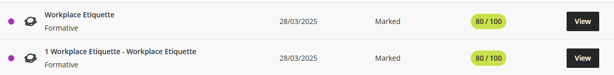
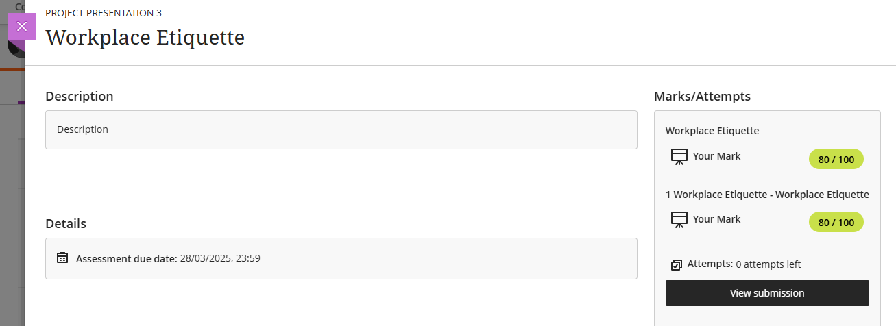

**Reflection**

**Situation:** I needed to go through the material on Interview Skills.  
**Task:** Go through the material, complete the quizzes, and apply what I learned to improve my professional conduct and communication in workplace environments.

**Action:** I carefully reviewed the slides and completed the quizzes, which tested my knowledge on appropriate workplace behavior—such as arriving early for meetings, handling confidential information responsibly, addressing rude or offensive emails professionally, and maintaining proper phone etiquette at work.
**Result:** I successfully completed the Workplace Etiquette module with an overall score of 80%. Through this activity, I gained a deeper understanding of how professionalism and respectful communication contribute to a positive work environment. I am now more confident in applying these principles in real workplace situations and in future professional interactions.